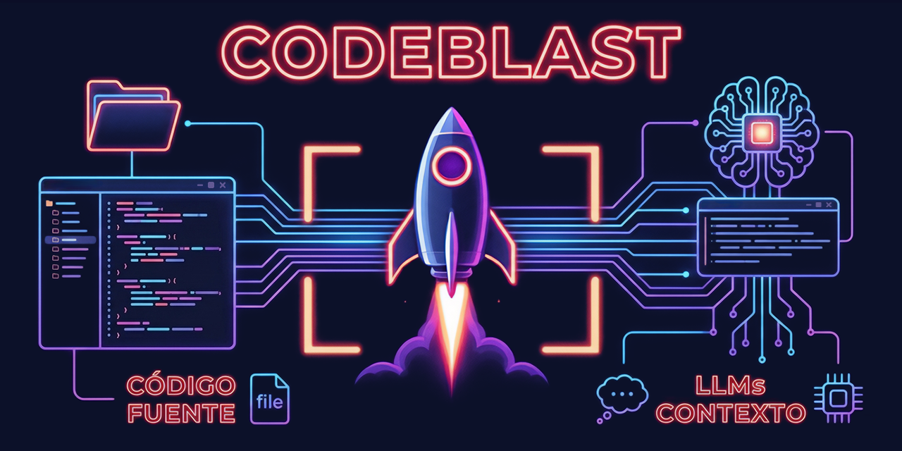
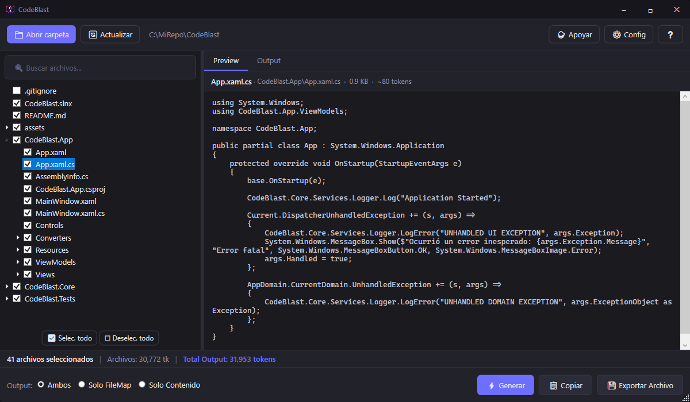
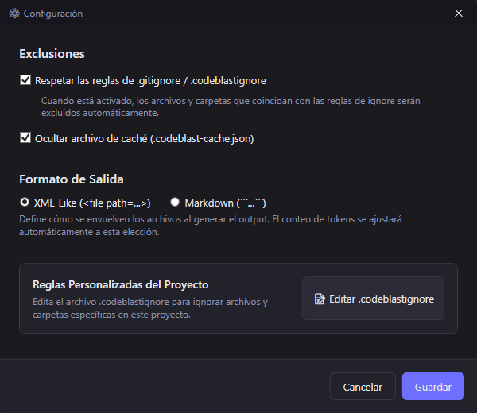
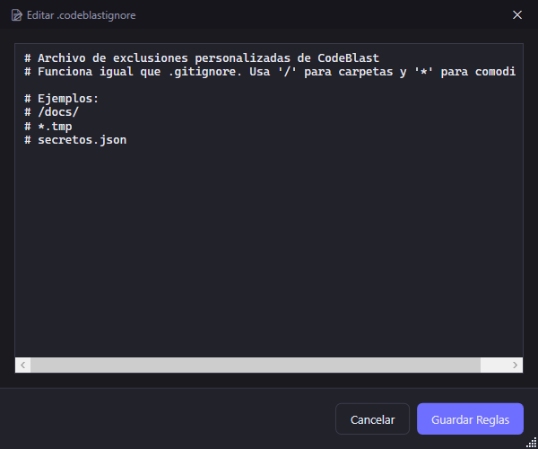

# CodeBlast 🚀



**El puente definitivo entre tu código fuente y los LLMs de alto contexto.**

CodeBlast es una herramienta de escritorio ultrarrápida y nativa para Windows (WPF) diseñada para empaquetar proyectos de software completos en un formato limpio, optimizado y listo para ser analizado por Modelos de Lenguaje Grande (LLMs) como Claude 4.5/4.6, GPT-5 o Gemini 3.1 Pro.

---

## 🧠 La Filosofía: Contexto Total vs. "Vibe Coding"

Actualmente, el desarrollo asistido por IA está dominado por agentes integrados en los IDEs (Copilot, Cursor, Windsurf, etc.). Esta metodología, conocida como *"vibe coding"*, es excelente para la creación inicial de andamiajes (scaffolding) y ediciones locales.

Sin embargo, **los agentes de IDE sufren de "ceguera de contexto" (Tunnel Vision)**. Dependen de sistemas de recuperación (RAG) o de la selección manual de fragmentos de código. Cuando un proyecto crece en tamaño y complejidad, estos agentes pierden la visión panorámica:

* Fallan al identificar cuellos de botella arquitectónicos globales.
* Introducen condiciones de carrera (Race Conditions) al no comprender el flujo completo de los subprocesos.
* Se les dificulta o son incapaces de realizar refactorizaciones profundas que cruzan múltiples capas del sistema.

**La solución es el Contexto Total (Holistic Context).**
Los LLMs modernos tienen ventanas de contexto masivas (de 200K a 2 Millones de tokens). Al proporcionarles el código fuente *completo* y estructurado de tu proyecto, el LLM adquiere **omnisciencia arquitectónica**. Puede ver cómo interactúa la UI con el backend, cómo se maneja el estado global y dónde están las ineficiencias de I/O.

**CodeBlast** nace para resolver el problema de empaquetar ese contexto de forma instantánea, descartando el "ruido" (binarios, dependencias, carpetas de compilación) y entregando solo la lógica de negocio que el LLM necesita ver.

### 📖 El caso de éxito: CodeBlast construyendo CodeBlast

CodeBlast es el mejor ejemplo de su propia utilidad. En sus primeras versiones, fue desarrollado mediante *vibe coding* con agentes de IDE. Rápidamente alcanzó un estado funcional, pero con graves problemas de rendimiento: la interfaz se congelaba, la lectura de archivos era secuencial y el conteo de tokens tardaba mucho en proyectos medianos. Los agentes del IDE, a pesar de tener el proyecto "a mano", no lograron optimizarlo.

Al usar CodeBlast para extraer el contexto completo y pasarlo a un LLM actuando como "Arquitecto Líder", se logró en tiempo récord:

1. Una reescritura asíncrona total usando `Parallel.ForEachAsync`.
2. La implementación de un sistema de caché de tokens en disco.
3. La resolución de condiciones de carrera mediante bloqueos (`lock`) precisos en memoria.
4. La integración de `DotNet.Glob` para un filtrado profesional de exclusiones.

---

### 🎩 "El Truco": La Metodología Arquitecto + Agente

El verdadero poder de CodeBlast no radica solo en leer código, sino en cómo habilita un flujo de trabajo imbatible de dos pasos. Cuando el "Vibe Coding" tradicional falla porque el agente del IDE no logra comprender el error o se enreda en bucles de código roto, aplicamos esta metodología:

1. **Extracción (CodeBlast):** Extraemos el contexto holístico del proyecto y se lo entregamos a un LLM avanzado (Claude 4.5/4.6, GPT-5 o Gemini 3.1 Pro) en su interfaz web.
2. **El Arquitecto (El LLM de alto contexto):** Le asignamos al LLM el rol de "Arquitecto Líder". Al tener la visión panorámica del sistema, el Arquitecto no escribe código directamente en tu IDE, sino que diagnostica el problema estructural y **redacta un plan de acción estricto y paso a paso (Instrucciones de Implementación a solicitud)**.
3. **El Operario (El Agente del IDE):** Creamos un documento Markdown o txt con las **Instrucciones de Implementación** generado por el Arquitecto y se lo pasamos al agente de nuestro IDE (Cursor, Windsurf, Copilot). Al recibir instrucciones precisas, delimitadas y con el problema ya resuelto lógicamente, el agente actúa como un programador impecable, ejecutando los cambios sin alucinaciones ni pérdida de contexto.

CodeBlast es el puente esencial que hace posible esta sinergia entre la inteligencia arquitectónica pura y la ejecución automatizada.

---

## 💡 La Estrategia de Consolidación de Contexto (Más Allá del Código)

La mayoría de los profesionales interactúan con las IAs mediante "prompts" cortos, desaprovechando las ventanas de contexto masivas de los modelos modernos (que hoy superan los millones de tokens).

La **Estrategia de Consolidación de Contexto** consiste en tomar información fragmentada (docenas de archivos sueltos, capítulos de un libro, módulos de código o reportes), unificarla en un único "Payload" estructurado y entregársela al LLM. Al tener la fotografía completa, la IA deja de ser un simple asistente de autocompletado y se convierte en un **co-razonador experto**.

CodeBlast es el motor que automatiza esta consolidación en segundos, expandiendo esta estrategia a múltiples sectores profesionales:

* 💻 **Equipos de Desarrollo:** Analizar arquitecturas legadas, buscar vulnerabilidades que cruzan múltiples microservicios o documentar APIs enteras en un solo paso.
* ⚖️ **Firmas Legales y Auditoría:** Cargar 50 contratos en formato `.docx` y pedirle a la IA: *"Analiza todos estos acuerdos y hazme un reporte si alguna cláusula de confidencialidad contradice nuestras políticas estándar."*
* 🎨 **Editoriales y Maquetadores:** Exportar una revista entera a `.idml`, pasarla por CodeBlast y pedirle al LLM: *"Revisa la ortografía, gramática y coherencia de estilo en todos los artículos de esta edición antes de mandarla a imprenta."*

### ✍️ Caso de Uso en Profundidad: El Escritor / Guionista

Imagina a un novelista escribiendo una obra de ciencia ficción. Tiene 25 capítulos repartidos en distintos archivos `.docx` y una carpeta entera con notas sobre la construcción del mundo (World-building).

Al sufrir un bloqueo creativo, el autor podría intentar resumirle la historia a ChatGPT, perdiendo matices vitales. Con **CodeBlast**, la estrategia cambia:

1. El escritor selecciona la carpeta raíz de su libro. CodeBlast extrae el texto puro de todos los `.docx` en menos de 2 segundos, ignorando imágenes o formatos pesados.
2. Genera el *Payload* y lo pega en un LLM de alto contexto (como Claude o Gemini).
3. Escribe el prompt: *"Actúa como un editor literario profesional. Acabas de leer el manuscrito completo de mi novela. ¿Existen agujeros de trama (plot holes) entre las reglas de los viajes espaciales que establecí en el Capítulo 3 y el desenlace del Capítulo 22? Sugiéreme 3 rumbos distintos para resolver el conflicto final manteniendo la coherencia de los personajes."*

El resultado es un análisis profundo, fundamentado en la obra real y no en resúmenes. Esa es la magia de la consolidación de contexto.

---

## ✨ Características Principales

* ⚡ **Velocidad Extrema:** Procesamiento paralelo y caché inteligente en disco (`.codeblast-cache.json`).
* 🎯 **Conteo Preciso de Tokens:** Integración nativa con `TiktokenSharp` (`cl100k_base`) para saber exactamente cuánto contexto consumirás antes de enviarlo al LLM.
* 🛡️ **Exclusiones Inteligentes:** Soporte total para `.gitignore`, reglas globales (ej. `node_modules`, `bin/`) y reglas personalizadas vía `.codeblastignore`.
* 📦 **Formatos Optimizados:** Exporta en un formato XML-Like (ideal para Claude) o Markdown (ideal para GPT/Gemini), incluyendo un mapa de árbol (File Map) del proyecto.

---

## 📸 Interfaz de Usuario



---

## 📚 Manual de Usuario

CodeBlast está diseñado para ser intuitivo y de cero fricción.

### 1. Abrir un Proyecto

Haz clic en **"Abrir carpeta"** y selecciona la raíz de tu proyecto. CodeBlast escaneará instantáneamente la estructura, ignorando automáticamente los archivos binarios y las carpetas de compilación o dependencias excluidas.

> **La Regla de Oro de los Formatos:**
>
> CodeBlast no solo procesa código; extrae texto puro a la velocidad del rayo de documentos modernos (`.docx`, `.odt`) y proyectos de maquetación de Adobe InDesign (`.idml`). Al procesarlos en memoria y sin dependencias pesadas, elimina estilos y geometrías para entregarle a la IA contexto 100% limpio.  
> *¿Tienes archivos heredados (`.doc`, `.rtf`) o `.pdf`? Simplemente usa la función "Guardar como .docx" en tu editor o "Exportar a IDML" en InDesign antes de pasarlos por CodeBlast. Esto garantiza un rendimiento extremo y precisión absoluta.*

### 2. Visualización y Selección

* **Árbol de Archivos:** Navega por tu proyecto. Puedes marcar o desmarcar carpetas enteras o archivos individuales. La UI actualizará en tiempo real el contador de archivos y tokens.
* **Preview:** Haz clic en el nombre de cualquier archivo para ver su contenido y sus metadatos (tamaño y tokens) en el panel derecho.
* **Filtro Visual:** Usa la barra de búsqueda superior para encontrar rápidamente un archivo. (Nota: La búsqueda solo filtra la vista, no modifica tu selección).

### 3. Configuración y Exclusiones

Haz clic en **"⚙ Config"** para abrir los ajustes del proyecto.



Desde aquí puedes:

* **Activar/Desactivar el respeto al `.gitignore`**.
* **Ocultar el archivo de caché:** Evita que el archivo `.codeblast-cache.json` ensucie tu output.
* **Elegir el Formato de Salida:** Define si quieres envolver tu código en XML (`<file path="...">`) o Markdown (` ``` `).

### 4. Editor de `.codeblastignore`

¿Tienes archivos específicos de tu entorno local que el LLM no necesita ver? Haz clic en **"📝 Editar .codeblastignore"** dentro de la configuración.



Se abrirá un editor interno nativo donde puedes escribir reglas (soporta sintaxis Glob estándar como `*.suo`, `docs/`, etc.). Al guardar, CodeBlast recargará el proyecto automáticamente aplicando tus nuevas reglas.

### 5. Generar y Exportar

En la barra inferior, selecciona qué deseas incluir:

* **Ambos:** Mapa del proyecto + Contenido del código.
* **Solo FileMap:** Útil si solo quieres que el LLM analice la estructura arquitectónica.
* **Solo Contenido:** Solo el código fuente.

Una vez decidido, puedes **"⚡ Generar"** (para verlo en la pestaña *Output*), **"📋 Copiar"** (directo al portapapeles) o **"💾 Exportar Archivo"** para guardarlo en tu disco como `.txt` o `.md` según tu configuración.

---

## 🛠️ Compilar desde el código fuente

CodeBlast está construido en **.NET 10** y **WPF**. Si deseas compilarlo tú mismo como un único ejecutable portable (sin necesidad de instaladores), ejecuta el siguiente comando en la raíz del repositorio:

```bash
dotnet publish CodeBlast.App/CodeBlast.App.csproj -c Release -r win-x64 --self-contained false -p:PublishSingleFile=true
```

*(Requerirá que el usuario final tenga el Desktop Runtime de .NET 10 instalado).*

Para una versión 100% independiente que incluya el runtime de .NET (pesa más, pero funciona en cualquier PC con Windows x64):

```bash
dotnet publish CodeBlast.App/CodeBlast.App.csproj -c Release -r win-x64 --self-contained true -p:PublishSingleFile=true -p:IncludeNativeLibrariesForSelfExtract=true -p:PublishReadyToRun=true
```

---

## 💖 Apoyo y Donaciones

CodeBlast es una herramienta gratuita y de código abierto. La desarrollamos para solucionar un problema real en nuestro flujo de trabajo diario.

Si esta herramienta te está ahorrando horas de copiar y pegar código, o te ha ayudado a destrabar un problema arquitectónico grave con tu LLM favorito, **considera invitarnos un café** usando el botón **"☕ Apoyar"** en la aplicación. ¡Cada grano de café se convierte en líneas de código!

---

*Diseñado con precisión algorítmica y pasión por el código limpio.*
